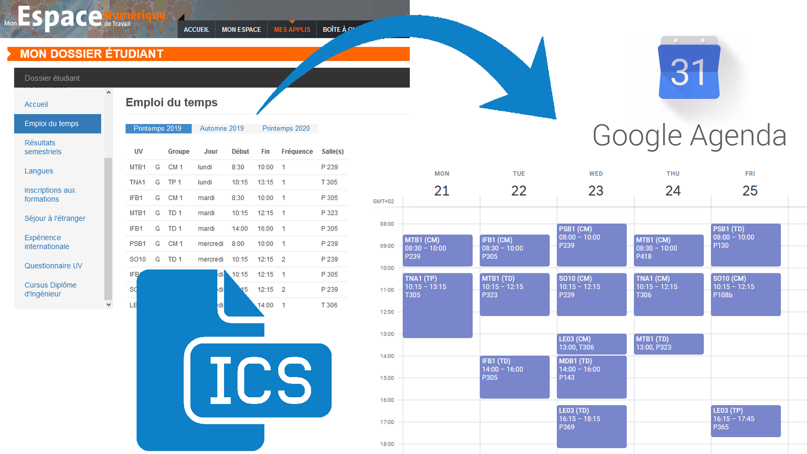

# UTBMPlanningToICS script #


## Author ##
Valentin Mercy - Licium

## Supported languages ##
* English
* French

## French ##
### Description du programme ###
Le programme UTBMPlanningToICS a pour but de simplifier la représentation de l'emploi du temps personnel des étudiants de l'UTBM (Université de Technologie de Belfort-Montbéliard) en leur permettant de transformer la liste de leurs cours (trouvable sur l'[espace personnel UTBM](https://monespace.utbm.fr/)) en un fichier standardisé au format ICS directement importable sur la plupart des utilitaires de planification (Google Agenda par exemple).

### Comment l'utiliser ###
* Premièrement, à l'aide d'un terminal bash, cloner localement le dépôt Git et changer le répertoire courant pour entrer dans le nouveau dossier ainsi créé :
```
git clone https://github.com/Valentin68/UTBMPlanningToICS.git
cd UTBMPlanningToICS/
```
* Aller sur l'[espace personnel UTBM](https://monespace.utbm.fr/), naviguer vers "Mon dossier étudiant" > "Emploi du temps" et copier (Ctrl-C) la liste des cours **avec l'entête**. Attention : le texte sélectionné doit commencer juste avant le mot "UV" et terminer juste après la salle du dernier cours !
* Coller (Ctrl-V) le texte copié dans un nouveau fichier texte, lequel doit finalement ressembler à ceci :
```
UV 		Groupe 	Jour 	Début 	Fin 	Fréquence 	Salle(s)
LO21 		TD 1 	lundi 	8:00 	10:00 	1 	P 130
LC00 		TD 1 	lundi 	14:00 	16:00 	1 	P 122
IFD1 		CM 1 	lundi 	16:15 	18:15 	1 	T 305
PS22 		TD 2 	mardi 	8:00 	10:00 	1 	P 243
MDA1 	A 	TD 1 	mardi 	14:00 	16:00 	1 	P 323
MTC7 		TD 2 	mardi 	16:15 	18:15 	1 	P 325
MDA1 	A 	CM 1 	mercredi 	8:30 	10:00 	1 	P 108b
LO21 		CM 1 	mercredi 	14:00 	16:00 	1 	T 306
LO21 		TP 2 	mercredi 	16:15 	19:15 	2 	P 334
MTC7 		TD 2 	jeudi 	8:00 	10:00 	1 	P 122
PS22 		CM 1 	jeudi 	10:15 	12:15 	1 	P 108b
PS22 		TP 2 	vendredi 	8:00 	10:00 	2 	P 226
IFD1 		CM 1 	vendredi 	10:15 	12:15 	1 	T 305
MTC7 		CM 1 	vendredi 	14:00 	16:00 	1 	P 243
LC00 		TP 4 	vendredi 	16:15 	17:15 	1 	P 145
```
* Sauvegarder le fichier avec le nom de votre choix (seul format .txt est imposé) à la racine du répertoire courant (qui contient également le script ```PlanningToICS.py``` et la liste des semaines A/B pour le semestre de référence, dans un fichier nommé ```SEM_A20.csv``` par exemple).
* Installer le module ICS pour **python 3**:
```
pip3 install ics

```
* Lancer le script PlanningToICS.py avec **python 3**:
```
python3 PlanningToICS.py
```
* Suivre les instructions
* Normalement, un nouveau fichier ```output.ics``` vient d'être créé à la racine du répertoire courant. Il ne reste plus qu'à l'importer dans l'utilitaire de votre choix (Google Agenda par exemple) !

## English ##
### Script description ###
UTBMPlanningToICS aims to simplify classes planning representation for UTBM students (UTBM = University of Technology of Belfort-Montbeliard). More precisely, this python script allows all UTBM students to turn the unformatted list of courses (which can be found on [their personnal space](https://monespace.utbm.fr/)) into a proper ICS file they can directly import on their favourite scheduling utility, such as Google Agenda for example.

### How to use it ###
* First, open a bash terminal, clone this repository and make it become your working directory :
```
git clone https://github.com/Valentin68/UTBMPlanningToICS.git
cd UTBMPlanningToICS/
```
* Go to your [UTBM personnal space](https://monespace.utbm.fr/), navigate to "Mon dossier étudiant" > "Emploi du temps" and copy (Ctrl-C) your list of classes **with the header**. Please ensure that your selection starts just before the word "UV" and ends just after the location of the very last class.
* Paste it into a new .txt file. That file must finally contain something like this :
```
UV 		Groupe 	Jour 	Début 	Fin 	Fréquence 	Salle(s)
LO21 		TD 1 	lundi 	8:00 	10:00 	1 	P 130
LC00 		TD 1 	lundi 	14:00 	16:00 	1 	P 122
IFD1 		CM 1 	lundi 	16:15 	18:15 	1 	T 305
PS22 		TD 2 	mardi 	8:00 	10:00 	1 	P 243
MDA1 	A 	TD 1 	mardi 	14:00 	16:00 	1 	P 323
MTC7 		TD 2 	mardi 	16:15 	18:15 	1 	P 325
MDA1 	A 	CM 1 	mercredi 	8:30 	10:00 	1 	P 108b
LO21 		CM 1 	mercredi 	14:00 	16:00 	1 	T 306
LO21 		TP 2 	mercredi 	16:15 	19:15 	2 	P 334
MTC7 		TD 2 	jeudi 	8:00 	10:00 	1 	P 122
PS22 		CM 1 	jeudi 	10:15 	12:15 	1 	P 108b
PS22 		TP 2 	vendredi 	8:00 	10:00 	2 	P 226
IFD1 		CM 1 	vendredi 	10:15 	12:15 	1 	T 305
MTC7 		CM 1 	vendredi 	14:00 	16:00 	1 	P 243
LC00 		TP 4 	vendredi 	16:15 	17:15 	1 	P 145
```
* Save this file into the working directory, that should also contain the main script ```PlanningToICS.py``` and the list of A/B weeks for the next semester : ```SEM_A20.csv``` for example.
* Install ICS module for **python 3**:
```
pip3 install ics

```
* Launch the main script with **python 3**:
```
python3 PlanningToICS.py
```
* Follow the instructions
* You should now have a new file named ```output.ics``` in your working directory. You can directly import it in your Google Agenda for example, and enjoy the result !

### How to contribute ###
Feel free to contribute to this project ! Here are some possible improvments :
* Create a GUI
* Turn it into a standalone utility, maybe a portable .exe for Windows users
* Use ICS RRULES for repeating events to link them together
* Detect overlapping classes, then warn and ask users which ones they want to keep
* Each semester, as the UTBM administration gives us the semester calendar, feel free to turn it into a SEM_XXX.csv file that can be read by this script. Please respect the following structure (only working periods must be listed) :
```
START;END;TYPE
14/09/20;21/09/20;A
21/09/20;28/09/20;B
28/09/20;05/10/20;A
05/10/20;12/10/20;B
12/10/20;19/10/20;A
19/10/20;26/10/20;B
02/11/20;09/11/20;A
09/11/20;16/11/20;B
16/11/20;17/11/20;A
18/11/20;18/11/20;B
19/11/20;22/11/20;A
23/11/20;29/11/20;B
29/11/20;06/12/20;A
07/12/20;14/12/20;B
14/12/20;20/12/20;A
04/01/21;06/01/21;B
07/01/21;07/01/21;A
08/01/21;08/01/21;B
```
As this file is the same for all UTBM students, feel free to push it to this repository so that others can benefit from it.